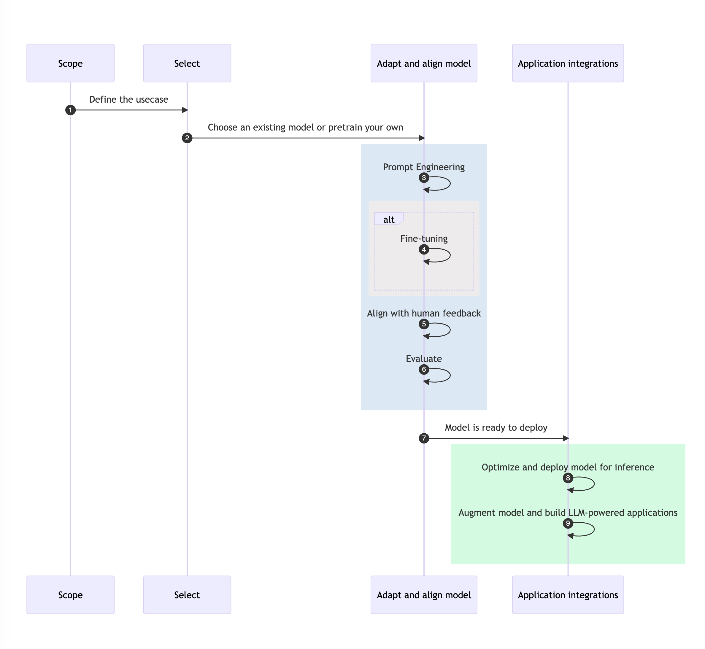
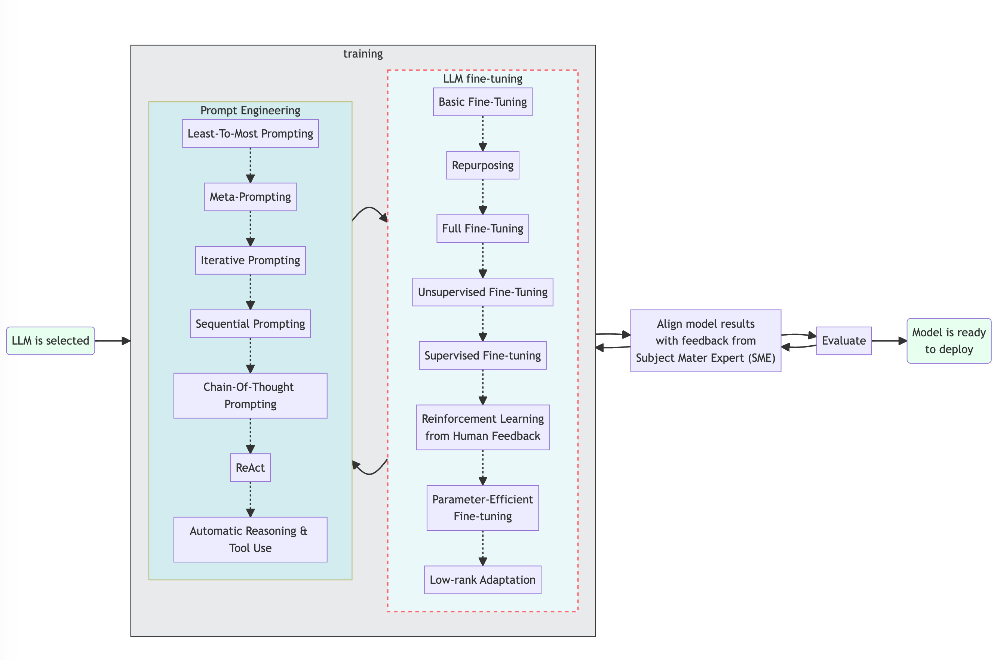
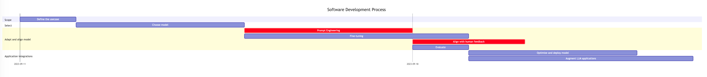

## Generative AI Project Lifecycle

### Stage 1: Define Scope

- Accurate and narrow scope definition is crucial.
- Model abilities depend on size and architecture.
- Clarifying the functions and tasks the LLM will perform can save time and compute cost.

### Stage 2: Model Selection

- Decide between training a model from scratch or using an existing base model.
- Various considerations and rules of thumb will be covered for this decision.

### Stage 3: Performance Assessment and Training

- Use in-context learning and prompt engineering to improve performance.
- Fine-tuning may be needed for specific tasks.
- Supervised learning and fine-tuning will be covered in detail.

### Stage 4: Model Behavior

- Importance of ensuring the model aligns with human preferences.
- Reinforcement learning with human feedback for better behavior.

### Stage 5: Evaluation

- Metrics and benchmarks for model performance and alignment.
- The adapt and align stage is iterative and may involve multiple rounds of prompt engineering and fine-tuning.

### Stage 6: Deployment

- Optimize the model for deployment to make the best use of compute resources.

### Stage 7: Additional Infrastructure

- LLMs have fundamental limitations, like inventing information or limited reasoning.
- Techniques to overcome these limitations will be covered.

## Gantt Diagramm

Some of the stages could be run in parallel, but the order of the stages is fixed.

